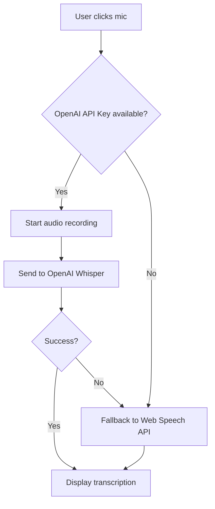

# 🎤 Voice Integration Setup Guide

## Overview
The orange microphone button now supports **dual-mode speech-to-text**:
1. **Primary**: OpenAI Whisper (high accuracy, requires API key)
2. **Fallback**: Browser Web Speech API (built-in, less reliable)

## 🔧 Setup Instructions

### 1. Get OpenAI API Key
1. Go to [OpenAI Platform](https://platform.openai.com/api-keys)
2. Create a new API key
3. Copy the key (starts with `sk-...`)

### 2. Environment Configuration
Add to your `.env.local` file:
```bash
OPENAI_API_KEY="sk-your-openai-api-key-here"
```

### 3. Test the Integration
1. Click the orange microphone button
2. Grant microphone permissions when prompted
3. Speak clearly for 2-5 seconds
4. Check the listening indicator shows which service is active:
   - "using OpenAI Whisper" = Primary mode (high accuracy)
   - "using Web Speech API" = Fallback mode (browser native)

## 🚀 How It Works

### Smart Fallback System
```typescript
// 1. Try OpenAI Whisper first (if API key available)
if (OPENAI_API_KEY) {
  record_audio() → send_to_openai() → transcribe()
}

// 2. Fallback to Web Speech API if OpenAI fails
else {
  use_browser_speech_api()
}
```

### Recording Process
1. **Record**: Captures audio with optimized settings for Whisper
2. **Upload**: Sends WebM audio to `/api/speech/transcribe`
3. **Transcribe**: OpenAI Whisper processes the audio
4. **Display**: Transcription appears in the input field

## 🎯 Benefits

### OpenAI Whisper Advantages:
- ✅ **Higher accuracy** (especially with accents/noise)
- ✅ **Consistent performance** across browsers
- ✅ **Better punctuation** and capitalization
- ✅ **Multi-language support** (80+ languages)
- ✅ **Works offline** (after recording)

### Web Speech API Fallback:
- ✅ **No API costs** (free browser feature)
- ✅ **Real-time transcription** (live results)
- ✅ **No server calls** (privacy-friendly)
- ❌ **Browser dependent** (inconsistent results)

## 🔍 Troubleshooting

### "Speech-to-text service not configured"
- **Problem**: Missing `OPENAI_API_KEY` in environment
- **Solution**: Add your OpenAI API key to `.env.local`

### Microphone button not working
- **Problem**: No microphone permissions
- **Solution**: Check browser permissions, allow microphone access

### Poor transcription quality
- **Problem**: Background noise or unclear speech
- **Solution**: 
  - Speak clearly and slowly
  - Reduce background noise
  - Use a better microphone
  - Ensure good internet connection for OpenAI mode

### Recording too short error
- **Problem**: Audio recording under 1KB
- **Solution**: Speak for at least 2-3 seconds before stopping

## 💰 Cost Considerations

### OpenAI Whisper Pricing:
- **$0.006 per minute** of audio transcribed
- Example: 100 voice messages (30 seconds each) = $0.30
- Very affordable for typical usage

### Recommendations:
- Development: Use free Web Speech API fallback
- Production: Enable OpenAI for better user experience
- High volume: Consider batch processing or local Whisper deployment

## 🔐 Security & Privacy

### Data Handling:
- Audio is sent to OpenAI for transcription only
- No audio is stored on our servers
- OpenAI may retain data according to their policy
- Web Speech API processes locally (more private)

### Compliance:
- Inform users about third-party processing
- Consider using Web Speech API only for sensitive applications
- Review OpenAI's data usage policy

## 🧪 Testing Checklist

- [ ] Orange mic button appears and is clickable
- [ ] Microphone permissions granted
- [ ] Visual indicator shows listening state
- [ ] Source indicator shows "OpenAI Whisper" or "Web Speech API"
- [ ] Transcribed text appears in input field
- [ ] Works in different browsers (Chrome, Firefox, Safari)
- [ ] Graceful fallback when OpenAI API fails
- [ ] Error handling for network issues

## 📈 Analytics & Monitoring

Monitor these metrics:
- OpenAI API success rate
- Fallback usage percentage
- Transcription accuracy (user feedback)
- Audio upload size and duration
- API response times

## 🔄 Fallback Behavior



This ensures the voice feature always works, regardless of configuration!