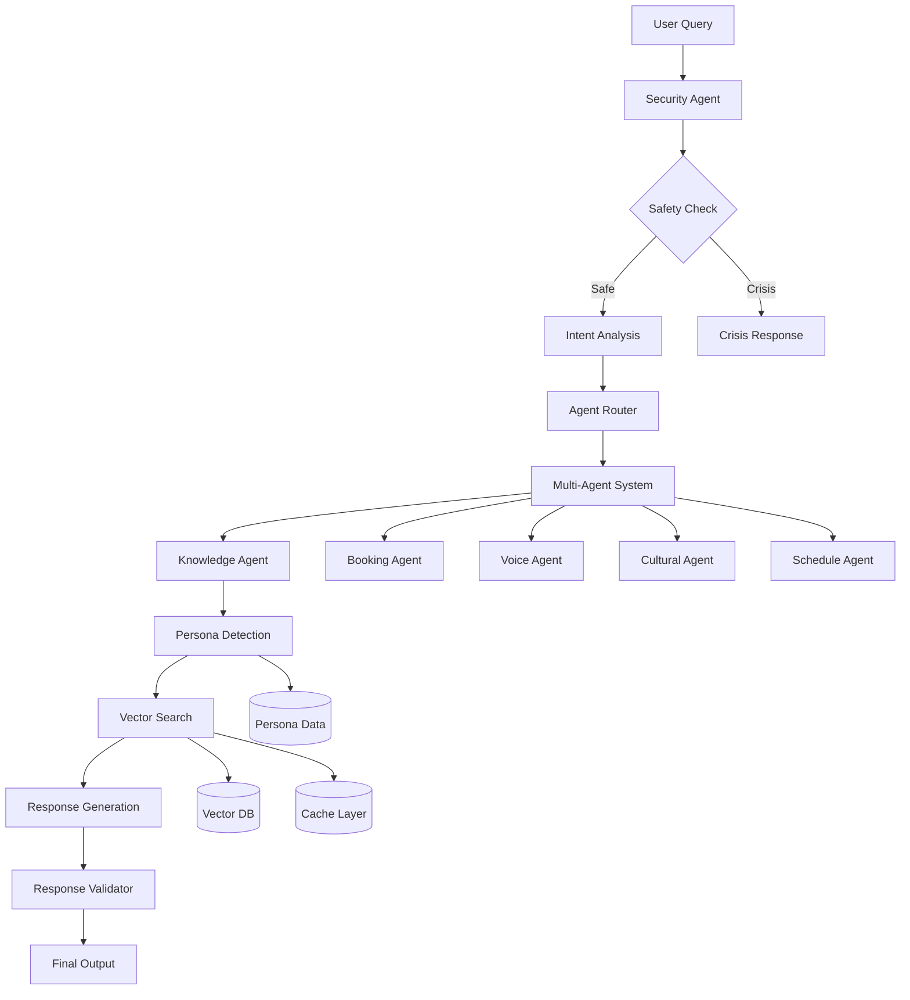

# 🏗️ Current Architecture Deep Dive

## System Architecture Map



## Current Performance Profile

### **Security Layer** (Critical Path)
```typescript
// BasicSecurityAgent.quickScan() - 50-100ms
1. Rate limiting check (cache lookup) - 5ms
2. Critical PII detection (regex) - 10ms  
3. Crisis pattern matching - 15ms
4. Threat detection - 20ms
5. Logging (async) - 0ms blocking
```

### **Multi-Agent Routing** (Parallel Processing)
```typescript
// routeToAgent() - 10-20ms
const agentRouting = {
  booking: /book|appointment|advisor|consultation/i,
  schedule: /interview|schedule|timeline|when|time/i,
  cultural: /international|cultural|visa|culture/i,
  voice: /presentation|speaking|communication/i,
  knowledge: // default fallback
};
```

### **Vector Search Pipeline** (Main Bottleneck)
```typescript
// Current flow - 400-800ms total
1. Query enhancement (Groq) - 200-400ms
2. Vector similarity search - 100-200ms
3. Persona-aware filtering - 50-100ms
4. Result ranking - 50ms
5. Response generation (Groq) - 200-600ms
```

### **Caching Strategy** (Performance Critical)
```typescript
const cacheStrategy = {
  intentAnalysis: 600000, // 10 minutes
  vectorResults: 300000,  // 5 minutes  
  personaDetection: 1800000, // 30 minutes
  rateLimiting: 60000,    // 1 minute
  securityMetrics: 86400000 // 24 hours
};
```

### **Parallel Processing Opportunities**
```typescript
// Currently NOT parallelized (opportunity!)
Promise.all([
  analyzeIntent(query),        // 200-400ms
  detectPersona(query),        // 100-200ms
  enhanceQuery(query, intent)  // 200-400ms
]);
// Could reduce 500-1000ms to 200-400ms
```

---

## Resource Utilization Analysis

### **Memory Profile** (Current)
- Base Next.js app: ~150MB  
- Vector embeddings: ~500MB
- Security agent patterns: ~50MB
- LLM model caching: ~200MB
- **Total: ~900MB baseline**

### **CPU Profile** (Per Request)
- Security scanning: 15-25% spike
- Vector similarity: 30-40% spike  
- LLM generation: 60-80% spike
- Response validation: 5-10% spike

### **Network Dependencies**
- Groq API: 200-600ms per call (2-3 calls per request)
- Vector DB: Local/cached
- Rate limiting: In-memory cache
- **Critical path: Groq API latency**

---

## Architectural Strengths & Weaknesses

### ✅ **Strengths**
1. **Safety-First Design**: Crisis detection never bypassed
2. **Multi-Agent Flexibility**: Easy to add new agents
3. **Persona Awareness**: Sophisticated user understanding
4. **Caching Strategy**: Good performance optimization
5. **Modular Security**: Easy to enhance security features

### ⚠️ **Optimization Opportunities**
1. **No Parallel Processing**: Sequential LLM calls
2. **Single Vector Source**: No external knowledge
3. **Cache Warming**: Cold start performance
4. **Response Quality**: No retrieval quality assessment
5. **Knowledge Gaps**: Static knowledge cutoff

### 🔍 **CRAG Integration Points**
```typescript
// Perfect insertion points for CRAG
1. Post-vector search: Evaluate result quality
2. Pre-response generation: Enhance with external data  
3. Agent-specific: Different CRAG strategies per agent
4. Parallel evaluation: Don't block main pipeline
5. Cache-aware: Cache CRAG evaluations
```